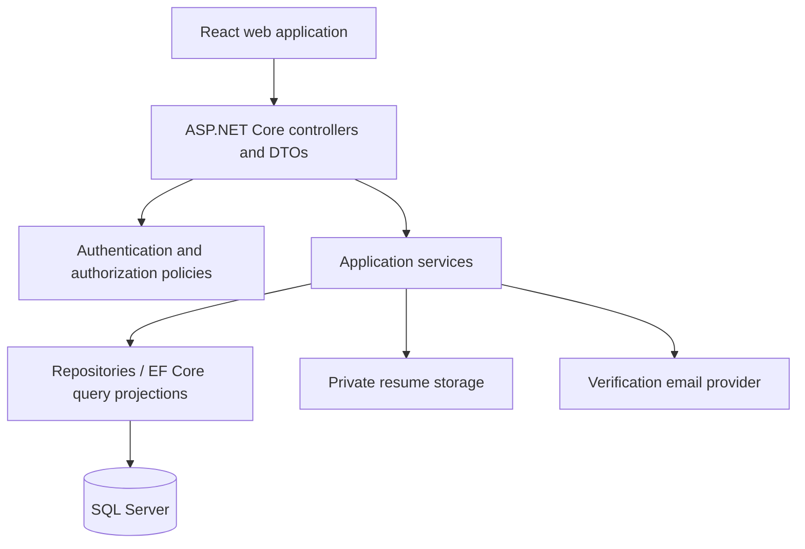

# Architecture

## Current architecture

| Layer | Current implementation |
| --- | --- |
| Browser UI | React + TypeScript + Vite; starter page only |
| HTTP host | ASP.NET Core targeting `net8.0`; development Swagger and HTTPS redirection |
| Domain | 14 entity classes and their enums in `CG/Models` |
| Persistence | EF Core with SQL Server, `AppDbContext`, initial migration |
| Repositories | 13 scoped repositories with basic reads, add/update/delete, and explicit `SaveChangesAsync` |
| Tests | xUnit/Moq/FluentAssertions packages declared; no test cases |

`Program.cs` registers controllers but does not map them. No controllers, business services, authentication, authorization policies, CORS policy, notification service, or file storage service exist. There is no `ApplicationRepository` even though `Applications` is a DbSet.

Repositories stage mutations until `SaveChangesAsync` is called. They share a scoped context through dependency injection. Most list reads load complete tables and track results; these are not suitable public search contracts. Navigation properties are not automatically populated by these queries; response shaping must query required data explicitly.

## Proposed architecture



Controllers handle HTTP concerns, bind DTOs, invoke application services, and return documented responses. Application services enforce workflows, ownership, membership scope, valid transitions, and transaction boundaries. Repositories and query projections provide persistence without deciding user permissions. SQL constraints defend invariants against races and direct writes.

Keep the existing project structure initially and add `Controllers`, `DTOs`, `Services`, `Authorization`, and `Storage` as needed. Splitting into multiple assemblies is optional once boundaries justify it; it is not required for the MVP.

Suggested services: account/verification, applicant profile, resume, company membership, job publication/search, application submission/pipeline, and moderation. Define interfaces where alternative providers or testing require them rather than adding abstractions without a consumer.

## Frontend structure proposal

```text
src/
  app/          Router, providers, application shells
  api/          HTTP client, DTOs, error mapping
  features/     auth, jobs, applicant, employer, admin
  components/   Shared controls and feedback components
  styles/       Tokens and shared styles
```

React Router provides navigation; TanStack Query manages server data and cache invalidation; React Hook Form manages forms; Axios provides the HTTP client. These packages are installed but not wired up. Markdown authoring/rendering and drag-and-drop are available dependencies, not implemented features.

Keep server data in query caches, transient form values in forms, and public search state in URL parameters. Authentication state must be resolved against the server. Frontend route guards improve navigation but never replace backend authorization.

## Data and transaction boundaries

Submission updates `IsSubmitted`, `ApplicationStatus`, `SubmittedAt`, and `UpdatedAt`, and writes an initial status log atomically. A status change updates the application and inserts its log atomically. Company creation and owner membership bootstrap are one transaction. Switching primary resumes may need two ordered saves inside a transaction to avoid temporarily violating the filtered unique index.

Use explicit DTOs rather than serializing tracked entities. DTOs prevent navigation cycles and exclude password hashes, verification tokens, stored paths, and internal notes. Public job projections must apply eligibility filters before paging.

Add optimistic concurrency tokens for application status changes, job editing, and membership decisions. The current models contain no concurrency tokens. The proposed API uses opaque versions; competing writes should return a conflict and require a fresh read.

## Authentication design

**Decision needed:** choose a session mechanism before implementing login. A server-managed cookie session with `HttpOnly`, `Secure`, appropriate `SameSite`, and CSRF defenses is a proposed browser-first option. Bearer authentication is an alternative if separate clients require it. Do not implement both by accident or imply that authentication already exists.

Authorization uses the authenticated account ID and server-side data. Never trust account role, applicant ID, company role, or company ownership supplied by the client. Session revocation and membership changes must take effect according to a defined policy rather than relying indefinitely on stale claims.

## Hosting proposal

Deploy the frontend as static assets and the API as an ASP.NET Core application with managed SQL Server and private file storage. A shared public origin with `/api` reverse proxying simplifies browser integration. Separate origins require explicit allowed origins and credential policies. No production hosting provider, pipeline, container configuration, or deployment manifest is currently selected.

Runtime configuration belongs to environment-specific secret/configuration systems. Build-time frontend configuration is public and cannot contain secrets. See the development and operations guides for local and release procedures.
