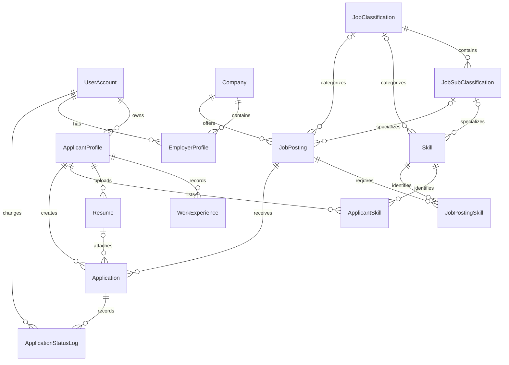

# Data model

## Current entities

All entities have integer `Id` keys. Required means non-nullable in the EF model; it does not necessarily mean nonempty strings or valid business data. String length annotations affect mapping but do not provide full business validation in repository writes.

| Entity | Main fields and limits | Relationships |
| --- | --- | --- |
| UserAccount | Email/PasswordHash 256; FirstName/LastName 100; Role; IsVerified; VerificationCode/Expiry; CreatedAt/UpdatedAt | Parent of profiles; referenced by approvers, job creators, and status actors |
| ApplicantProfile | UserAccountId; Headline/HomeLocation 150; Bio 1500; CreatedAt | Account; experience, resumes, skills, applications |
| EmployerProfile | UserAccountId; CompanyId; ApproverByMemberId; CompanyRole; MembershipStatus; JoinedAt | Account, company, approver account |
| Company | Name 150; Description 1500; WebsiteUrl/LogoUrl 2083; Code 10; VerificationStatus; ApprovedByAdminId/ApprovedAt; CreatedAt | Admin account; memberships and jobs |
| WorkExperience | ApplicantProfileId; JobTitle 100; Company/Location 150; Description 1500; StartDate/EndDate; IsCurrentRole | Applicant |
| Resume | ApplicantProfileId; OriginalFileName/StoredFileName 255; FilePath 500; FileExtension 10; ContentType 100; FileSizeInBytes; IsPrimary; UploadedAt | Applicant; optionally referenced by applications |
| Skill | Name 100; optional JobClassificationId/JobSubClassificationId; CreatedAt | Taxonomy; applicant/job skill associations |
| ApplicantSkill | ApplicantProfileId; SkillId; optional ProficiencyLevel/YearsOfExperience | Applicant and skill |
| JobClassification | Name 100; optional Description; CreatedAt | Subclassifications and optional job/skill category |
| JobSubClassification | JobClassificationId; Name 100 | Parent classification |
| JobPosting | CompanyId; CreatedByEmployerId; optional taxonomy/admin IDs; Title 150; RequirementsMarkdown 5000; JobType/WorkEnvironment; Location; MinSalary/MaxSalary; ApprovalStatus; ApprovedAt; IsActive; PostedAt/UpdatedAt | Company; creator account; optional taxonomy/admin; skills/applications |
| JobPostingSkill | JobPostingId; SkillId; IsRequired | Posting and skill |
| Application | JobPostingId; ApplicantProfileId; optional ResumeId; IsSubmitted; DraftStep; CoverLetter 2000; ApplicationStatus; SubmittedAt/UpdatedAt | Posting, applicant, optional resume |
| ApplicationStatusLog | ApplicationId; ChangedByUserId; optional OldApplicationStatus; NewApplicationStatus; optional Notes; ChangedAt | Application and actor account |

`DraftStep` is currently a boolean defaulting to true; it cannot represent a numbered multi-step progress indicator. `CreatedByEmployerId` points to `UserAccount`, not `EmployerProfile`. `ApproverByMemberId` also points to `UserAccount`, so the database alone cannot prove that the approver is an authorized company member.

## Relationship diagram

This diagram reflects current cardinality, including the current allowance for multiple applicant profiles per account.

Approver/creator account relationships are omitted from the diagram for readability; the table and migration retain them.

## Enumerations

| Enum | Values in declaration order |
| --- | --- |
| Role | Applicant, Employer, Admin |
| CompanyRole | Owner, Admin, Recruiter, HiringManager |
| VerificationStatus / MembershipStatus | Pending, Approved, Rejected |
| ApprovalStatus | Draft, Pending, Published, Rejected |
| JobType | Full_Time, Part_Time, Contractual_Temporary |
| WorkEnvironment | On_Site, Hybrid, Remote |
| ProficiencyLevel | Beginner, Intermediate, Advanced, Expert |
| ApplicationStatus | Draft, Applied, Screening, Interviewing, Hired, Rejected |

String conversion currently applies to Role, company verification, membership status, proficiency, job approval/type/work environment, and application status. CompanyRole and status-log enum fields are integers in the migration. Proposed API values are named strings regardless of database storage; JSON enum conversion is not yet configured.

## Current table names

The final mapping uses `UserAccount`, `ApplicantProfiles`, `EmployerProfiles`, `Companies`, `WorkExperience`, `Resumes`, `Skills`, `ApplicantSkill`, `JobClassifications`, `JobSubClassification`, `JobPosting`, `JobPostingSkills`, `Applications`, and `ApplicationStatusLogs`.

Some early `ToTable` calls use plural names that later calls override. This is inconsistent naming, not evidence that two tables exist. Migration scripts must use the final mapped names.

## Current constraints and indexes

| Area | Implemented database rule |
| --- | --- |
| Accounts | Unique email; allowed role names; basic `LIKE` email pattern |
| Subclassifications | Unique `(JobClassificationId, Name)` |
| Applicant skills | Unique `(ApplicantProfileId, SkillId)`; allowed nullable proficiency |
| Resume default | Unique ApplicantProfileId filtered by `IsPrimary = 1` |
| Company/membership | Allowed verification/membership status names |
| Jobs | Allowed approval/type/work environment names; max salary at least min salary when both exist |
| Job skills | Unique `(JobPostingId, SkillId)` |
| Applications | Unique `(JobPostingId, ApplicantProfileId)`; allowed status names |
| Experience | Current role requires null EndDate |

Foreign-key indexes exist through explicit configuration and conventions. Skill name is indexed but not unique. Email matching depends on SQL Server collation; consistent normalization still needs implementation. The email check is not a complete email validator.

The two `HasIndex(ApplicantProfileId)` calls for resumes configure the same index, so the migration contains the filtered primary-resume index rather than a separate general applicant-resume index. A full owner lookup index can be added under a distinct model index name if query plans warrant it.

## Delete behavior

The migration cascades account deletion to profiles; applicant deletion to experience, resumes, applicant skills, and applications; company deletion to memberships and jobs; job deletion to applications and job skills; application deletion to status logs; and skill deletion to association rows. Classification deletion cascades to subclassifications and sets the direct skill classification FK null.

Approver/creator account FKs, skill subclassification, job taxonomy, and application-resume references do not cascade. Referenced rows can therefore block deletion. In particular, deleting a classification with referenced subclassifications can fail even though direct skill classification references are configured to become null. Do not promise unconditional deletion or implement broad hard-delete endpoints without handling the complete dependency graph.

Proposed policy: close jobs rather than deleting recruitment history, and restrict resume deletion while referenced by submitted applications. Account erasure, anonymization, and retention need an agreed policy and coordinated storage/database handling.

## Integrity gaps to address

1. Add a unique account FK for applicant profiles to support one profile per applicant account. Decide whether employers may belong to multiple companies; at minimum prevent duplicate `(UserAccountId, CompanyId)` memberships and scope member lookup accordingly.
2. Make membership approver nullable for pending requests and owner bootstrap. Enforce authorized approvers in services.
3. Add experience date-order validation and a database check; the model comment currently claims this check exists.
4. Validate CompanyRole values; its promised check is absent.
5. Ensure an application's resume belongs to the same applicant. A composite ownership relationship or service check plus appropriate integrity strategy is required.
6. Ensure selected subclassification belongs to the selected classification for jobs and skills.
7. Enforce submission invariants: draft implies not submitted and no SubmittedAt; submitted implies non-draft, IsSubmitted=true, and a timestamp.
8. Add concurrency tokens; explicit UpdatedAt maintenance; consistent UTC persistence for instants. Current initializers use `DateTime.Now`, and repositories do not automatically refresh UpdatedAt.
9. Define unique company code generation if codes are used for membership discovery. Code is currently neither generated nor constrained unique.
10. Add salary currency/pay period, moderation reasons/history, verification token protection, and session storage if chosen designs require them. These do not exist in the present schema.

## Migration practice

Treat the initial migration as the current schema baseline, not proof of deployment to a database. Add follow-up migrations for agreed fixes rather than modifying a migration already applied to shared environments. Use a dedicated development/test database, inspect generated SQL, plan backfills before adding uniqueness, and coordinate file metadata changes with storage behavior. Production migration and rollback planning are covered in the operations guide.
