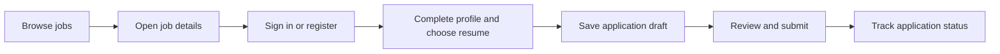

# Product requirements

## Purpose and scope

Career Grid connects job seekers with company hiring teams. Its JobStreet-inspired experience should emphasize searchable job listings, clear job details, reusable applicant profiles, straightforward applications, and transparent application tracking. Company verification and moderated publication support trust; a hiring pipeline supports employer work after applications arrive.

**Current:** the domain is represented in backend models; user workflows are not implemented. The following MVP requirements and rules are **proposed**.

## Users and permissions

The platform account role is `Applicant`, `Employer`, or `Admin`. An employer also has a company role: `Owner`, `Admin`, `Recruiter`, or `HiringManager`. Company `Admin` is distinct from platform `Admin`.

| Capability | Guest | Applicant | Approved company member | Platform admin |
| --- | --- | --- | --- | --- |
| Browse published, active jobs and public company information | Yes | Yes | Yes | Yes |
| Manage own applicant profile, experience, skills, and resumes | No | Yes | No | No by default |
| Draft, submit, and view own applications | No | Yes | No | No by default |
| View company applications and applicant resumes | No | No | Within permitted company scope | No by default |
| Create and maintain company jobs | No | No | According to company role | Moderation only |
| Review company verification and job publication | No | No | No | Yes |
| Approve employer memberships | No | No | Owner/company admin | Exceptional support policy unresolved |

Proposed company permissions:

| Company role | Membership management | Company profile | Job editing/submission | Candidate status changes |
| --- | --- | --- | --- | --- |
| Owner | Yes | Yes | Yes | Yes |
| Admin | Yes | Yes | Yes | Yes |
| Recruiter | No | Read | Yes | Yes |
| HiringManager | No | Read | Read | Yes |

For the MVP, candidate access is company-wide for approved members allowed to manage applications. Per-job assignments are a later feature requiring new data relationships. Pending or rejected memberships grant no company workspace access. Account role alone does not establish company access.

## MVP requirements

| ID | Requirement | Acceptance criteria |
| --- | --- | --- |
| AUTH-01 | Account registration and login | Applicant/employer self-registration validates input; public registration cannot select platform Admin; password hashes never appear in responses |
| AUTH-02 | Email verification | Expiring, single-use verification process; responses do not disclose sensitive account information; submission is blocked for unverified accounts under the proposed policy |
| APP-01 | Applicant profile | One applicant profile per account; owner can update headline, location, and biography |
| APP-02 | Work experience and skills | Owner manages experience and unique skill associations; date ordering and proficiency values are validated |
| APP-03 | Resume library | Owner uploads, selects a primary resume, downloads, and removes eligible resumes; unauthorized users cannot access files |
| JOB-01 | Public job discovery | Search and filters return only published, active jobs from approved companies; results are paginated |
| JOB-02 | Job details | Title, company, requirements, classification, work arrangement, job type, location, and available salary values are shown clearly |
| APPLY-01 | Draft application | Applicant can save a draft for a job; employer cannot view it; resume must belong to the applicant |
| APPLY-02 | Submission | Verified applicant submits to an eligible job once; submission timestamp and status are set atomically |
| APPLY-03 | Applicant tracking | Applicant sees their own submitted applications and public status history without internal recruiter notes |
| EMP-01 | Company registration and joining | Employer creates a pending company or requests membership; membership approval is separate from company verification |
| EMP-02 | Company administration | Owner/admin manages company details and pending membership requests within their company |
| EMP-03 | Job authoring | Permitted member edits a Markdown draft and submits for platform review |
| EMP-04 | Hiring pipeline | Permitted company member sees submitted applications, opens authorized resumes, and records status transitions |
| ADM-01 | Company moderation | Platform admin records approval or rejection; approver and timestamp are recorded on approval |
| ADM-02 | Job moderation | Platform admin publishes or rejects pending jobs; unpublished postings remain unavailable publicly |

## Applicant workflow

Search should support keyword, location, classification, subclassification, job type, work environment, and salary range where values exist. Salary filters must not assume a currency or pay period until those concepts are specified. Search queries should persist in URL parameters.

Submission checks ownership, account verification, job eligibility, duplicate application, resume eligibility, and field limits. Employer visibility begins only after successful submission. Draft edits are allowed; submitted application content is immutable for the MVP. Withdrawal and reapplication are outside the initial scope because the current status enum cannot represent withdrawal and the uniqueness constraint prevents a second application.

## Employer workflow

Proposed owner bootstrap: when a company is created, create its owner's approved membership in the same transaction, while the company remains pending platform verification. This is a special system action, not self-approval available to ordinary membership requests. Pending company owners can manage their company information and job drafts but cannot publish or receive new applications. This requires making the membership approver nullable and defining the bootstrap exception explicitly.

Joining an existing company creates a pending membership. Owners/admins decide the request and assign permitted company roles. A member cannot approve their own request, elevate themselves, or modify another company. Company codes are identifiers for finding/requesting a company; possession of a code never grants approval.

## Proposed state machines

Company and membership states are `Pending`, `Approved`, and `Rejected`. Initial review permits `Pending -> Approved` or `Pending -> Rejected`. Reopening rejected requests and revoking approvals need an explicit policy; do not silently use `Rejected` as a suspension state.

Job publication:

| From | To | Actor and condition |
| --- | --- | --- |
| Draft | Pending | Permitted company member; company approved; required fields valid |
| Pending | Published | Platform admin; company still approved |
| Pending | Rejected | Platform admin; review reason provided |
| Rejected | Draft | Permitted company member revises for resubmission |
| Published | Draft | Proposed material-edit policy: remove public visibility before editing/resubmission |

`IsActive` is independent of approval. A published job can be closed by setting `IsActive=false`; this blocks new applications while preserving prior records. Reopening requires a still-approved company and published posting. Automatic expiry is not represented in the current model.

Application status:

| From | Allowed next states | Actor |
| --- | --- | --- |
| Draft | Applied | Applicant through submission only |
| Applied | Screening, Rejected | Authorized hiring team |
| Screening | Interviewing, Rejected | Authorized hiring team |
| Interviewing | Hired, Rejected | Authorized hiring team |
| Hired | None in MVP | Terminal |
| Rejected | None in MVP | Terminal |

No backward moves or stage skipping in this proposed baseline. Every successful transition writes the old status, new status, actor, timestamp, and optional internal notes in the same transaction as the application update. Drag-and-drop must obey this table.

## Validation rules

- Use current model maximum lengths as the initial field limits; see the data model.
- Trim text where appropriate and normalize emails consistently before uniqueness checks and storage.
- Reject unknown enum values and invalid foreign-key relationships.
- Enforce `EndDate >= StartDate` when an end date exists and require no end date for a current role.
- Enforce nonnegative salary values and `MaxSalary >= MinSalary` when both exist. Currency and pay period need a decision before real salary comparisons.
- Enforce classification/subclassification consistency when both are selected.
- Permit at most one primary resume per applicant, while allowing multiple non-primary resumes.
- Validate optional field clearing separately from omitted fields in partial updates.

## Nonfunctional requirements

Proposed release criteria: responsive layouts, keyboard access to all actions, readable loading/error/empty states, server-enforced authorization, bounded result pages, safe resume storage, sanitized Markdown, auditability of sensitive actions, and recoverable backups. Performance budgets should be agreed and measured on representative data rather than inferred from local builds.

## Outside MVP

Saved jobs, alerts, recommendations, messaging, interview scheduling, assessments, social login, subscriptions/payments, native mobile applications, employer analytics, withdrawal, and multi-role accounts are possible later features. They are not represented as completed features or promised scope. Employer invites, moderation reason history, and notification preferences also require additional structures.
